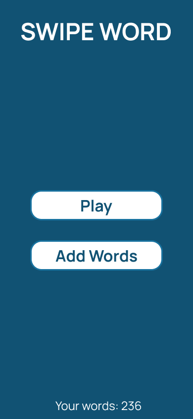
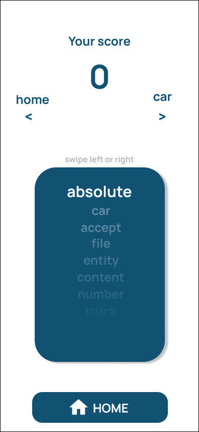
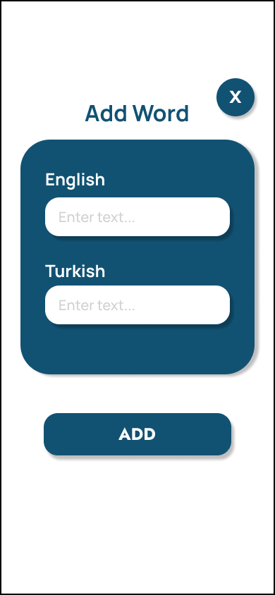
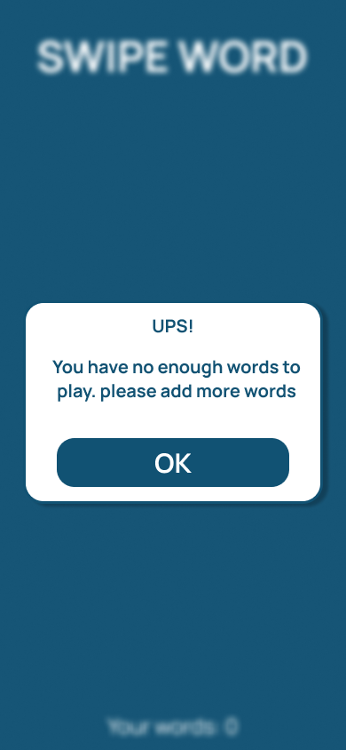

<p style="display: flex; gap: 16px;">
  
  
  
  
</p>

# Technical Documentation

## Learn-Word-React-Native

### Architecture Overview
The `Learn-Word-React-Native` application is a mobile application designed to help users learn words in different languages. The application is built using React Native and leverages several libraries and tools to provide a seamless user experience.

### Key Components
- **React Native**: The core framework for building the mobile application.
- **Expo**: A framework and platform for universal React applications.
- **React Navigation**: A popular library for managing navigation in React Native applications.
- **SQLite**: A lightweight disk-based database that stores the words to be learned.
- **Expo SQLite**: A library to interact with SQLite databases in Expo projects.
- **Expo Status Bar**: A component to display the status bar.
- **Expo Blur**: A library to create blur effects.
- **Expo Linear Gradient**: A library to create linear gradients.
- **React Native Deck Swiper**: A library to create a deck swiper component.
- **React Native Safe Area Context**: A library to handle safe areas on iOS devices.
- **React Native Screens**: A library to optimize the rendering of screens.
- **React Native Toast Message**: A library to display toast messages.

### Setup & Installation
To set up and install the `Learn-Word-React-Native` application, follow these steps:

1. **Clone the Repository**
   ```sh
   git clone https://github.com/myk794/Learn-Word-React-Native.git
   cd Learn-Word-React-Native
   ```

2. **Install Dependencies**
   ```sh
   npm install
   ```

3. **Start the Application**
   ```sh
   npm start
   ```

### API Documentation
The application does not use any external APIs. All data is stored locally using SQLite.

### Database Schema
The application uses an SQLite database to store the words. The schema for the `words` table is as follows:

```sql
CREATE TABLE IF NOT EXISTS words (
    id INTEGER PRIMARY KEY AUTOINCREMENT,
    en TEXT NOT NULL,
    tr TEXT NOT NULL
);
```

### Configuration
The configuration for the application is managed through the `app.json` file. Key configurations include:

- **Name**: The name of the application.
- **Version**: The version of the application.
- **Orientation**: The orientation of the application.
- **Icon**: The icon of the application.
- **User Interface Style**: The user interface style of the application.
- **Splash Screen**: The splash screen configuration.
- **Asset Bundle Patterns**: The patterns for asset bundling.
- **iOS and Android Configurations**: Specific configurations for iOS and Android platforms.

### Development Guidelines
- **Code Style**: Follow the Airbnb JavaScript Style Guide.
- **Version Control**: Use Git for version control.
- **Testing**: Write unit tests for critical components.
- **Documentation**: Keep the documentation up-to-date.

### Deployment Instructions
To deploy the application, follow these steps:

1. **Build the Application**
   ```sh
   expo build:android
   expo build:ios
   ```

2. **Upload to App Stores**
   - **Android**: Upload the APK to the Google Play Store.
   - **iOS**: Upload the IPA to the Apple App Store.

### File Structure
```plaintext
Learn-Word-React-Native/
├── .gitignore
├── app.json
├── babel.config.js
├── eas.json
├── package.json
├── package-lock.json
├── README.md
├── App.js
├── assets/
│   ├── icon.png
│   ├── splash.png
│   ├── adaptive-icon.png
│   ├── favicon.png
│   └── words.json
├── screens/
│   ├── AddWordScreen.js
│   ├── components/
│   │   ├── AddForm.js
│   │   ├── HomeButton.js
│   │   └── WordBlock.js
│   ├── HomeScreen.js
│   ├── learnScreen.js
│   └── WordListScreen.js
└── node_modules/
```

### Conclusion
The `Learn-Word-React-Native` application is a comprehensive tool for learning words in different languages. With its modular architecture and use of modern libraries, it provides a robust and user-friendly experience.
